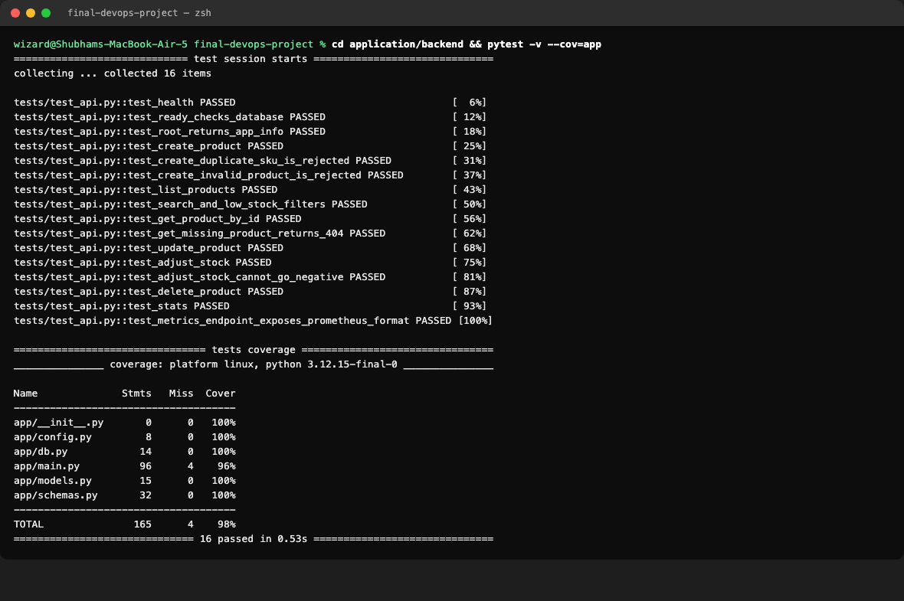
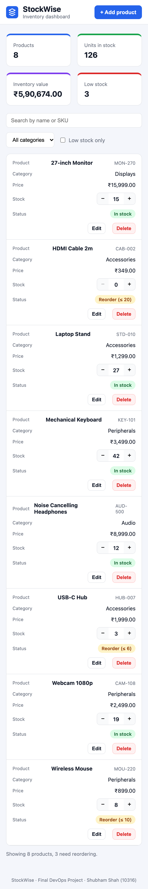
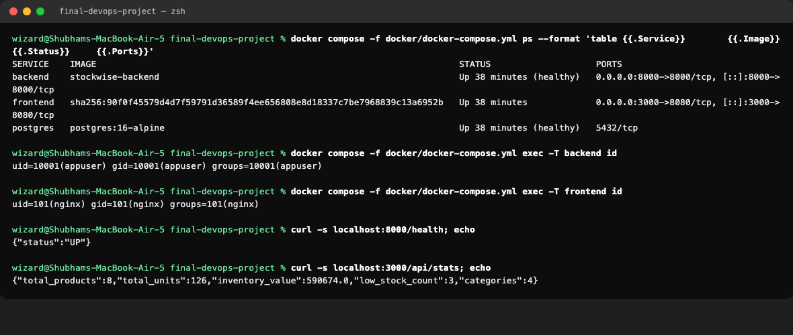
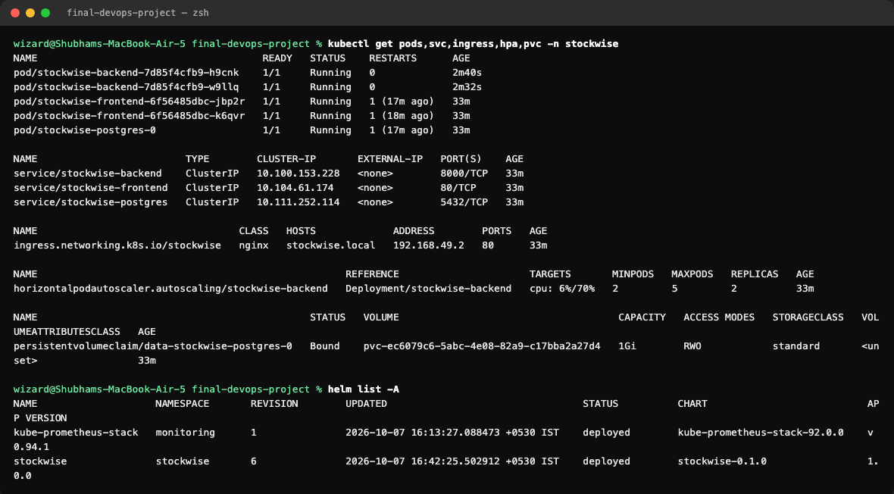
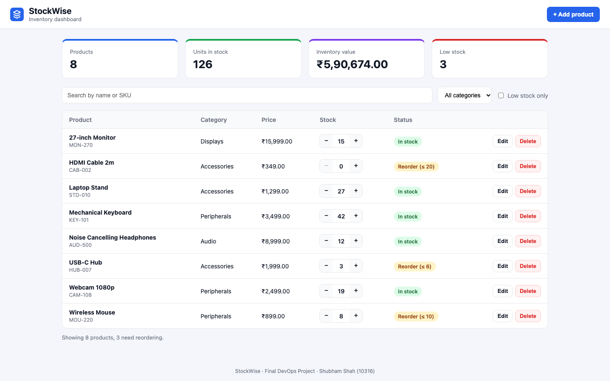
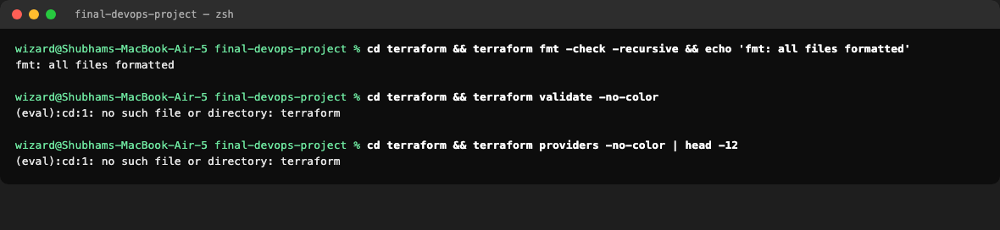

# StockWise: End-to-End DevOps Project

**Name:** Tirth Shah  
**Roll Number:** 10316  
**Session 21:** Final DevOps Project and Troubleshooting

StockWise is an inventory management app for a small electronics store. Staff can add products, track stock levels, adjust quantities as goods arrive or ship, and see which items need reordering. Around the app sits the full DevOps toolchain from the course: Git, CI/CD, DevSecOps, Docker, Kubernetes, Helm, Terraform, monitoring and GitOps.


---

## 1. Architecture


```
Code ─► GitHub ─► CI (test, build) ─► security scans ─► Docker images ─► GHCR
                                                                          │
     Git (values-gitops.yaml) ◄── CI commits the new image SHA ◄──────────┘
             │
          Argo CD ─► Kubernetes (EKS via Terraform, or minikube) ─► Helm release
                         │
                         └─► Prometheus + Grafana monitor the app
```

## 2. Technologies Used

| Area | Tools |
|---|---|
| Backend | Python 3.12, FastAPI, SQLAlchemy 2, Alembic, Pydantic |
| Frontend | React 19, Vite 8, served by nginx |
| Database | PostgreSQL 16 |
| Testing | pytest, pytest-cov, FastAPI TestClient with SQLite |
| Containers | Docker, multi-stage builds, Docker Compose |
| CI/CD | GitHub Actions, GitHub Container Registry (GHCR) |
| Security | Bandit, CodeQL, pip-audit, npm audit, Gitleaks, Trivy |
| Orchestration | Kubernetes, Helm, nginx Ingress, HPA, metrics-server |
| Infrastructure | Terraform, AWS VPC, AWS EKS |
| Monitoring | Prometheus, Grafana, Alertmanager (kube-prometheus-stack) |
| GitOps | Argo CD |

## 3. Repository Structure

```
final-devops-project/
├── application/
│   ├── backend/                 # FastAPI app, Alembic migrations, 16 pytest tests, Dockerfile
│   └── frontend/                # React app, nginx config, multi-stage Dockerfile
├── docker/                      # docker-compose.yml (frontend + backend + postgres)
├── kubernetes/                  # namespace.yaml and Kubernetes notes
├── helm/stockwise/              # Helm chart: deployments, services, ingress, HPA, secret, configmap, postgres, job
├── terraform/                   # AWS VPC + EKS
├── security/                    # DevSecOps notes and a local image scan script
├── monitoring/                  # Prometheus and Grafana values, dashboard, alert rules
├── gitops/                      # Argo CD Application
├── troubleshooting/             # Final troubleshooting challenge
├── scripts/                     # seed.sh and load-test.sh
├── screenshots/
├── architecture.png / .svg
└── README.md

.github/workflows/final-project-ci-cd.yml    # at the repository root, where GitHub requires it
```

This project lives in a folder of the course homework repository. GitHub only runs workflows from the repository root, so the pipeline sits in `.github/workflows/` and uses a `paths` filter so that it runs only for this folder.

---

## 4. Application Setup

### API

| Method | Endpoint | Purpose |
|---|---|---|
| GET | `/health` | Liveness: the process is running |
| GET | `/ready` | Readiness: the database is reachable |
| GET | `/metrics` | Prometheus metrics |
| GET | `/api/products` | List products, with `q`, `category` and `low_stock` filters |
| POST | `/api/products` | Create a product (409 if the SKU exists) |
| GET | `/api/products/{id}` | Get one product |
| PUT | `/api/products/{id}` | Update a product |
| PATCH | `/api/products/{id}/stock` | Receive or ship stock (cannot go below 0) |
| DELETE | `/api/products/{id}` | Delete a product |
| GET | `/api/stats` | Totals: products, units, inventory value, low stock |

Interactive API documentation is at `/docs`.


The `products` table is created by the Alembic migration `alembic/versions/0001_create_products.py`.

### Tests

```bash
cd application/backend
python3.12 -m venv .venv && source .venv/bin/activate
pip install -r requirements-dev.txt
pytest -v --cov=app
```

16 tests cover every endpoint, including error cases: duplicate SKU, invalid input, missing product, and negative stock. `tests/conftest.py` points the app at a throwaway **SQLite** database, so the tests never touch PostgreSQL.



### Responsive UI

The layout adapts to phones. Stat cards stack, and the product table becomes a list of cards.



---

## 5. Docker Setup

```bash
docker compose -f docker/docker-compose.yml up --build -d
./scripts/seed.sh http://localhost:8000
```

Open http://localhost:3000. Details are in [docker/README.md](docker/README.md).



## 6. Kubernetes Deployment

The chart deploys the backend (2 to 5 pods, autoscaled), the frontend (2 pods) and PostgreSQL (StatefulSet with a 1Gi volume). It adds ClusterIP Services, an Ingress, a ConfigMap, a Secret, probes, resource limits, an HPA and a migration Job. Details are in [kubernetes/README.md](kubernetes/README.md).






## 7. Helm Deployment

```bash
kubectl apply -f kubernetes/namespace.yaml
helm upgrade --install stockwise helm/stockwise -n stockwise -f helm/stockwise/values-local.yaml --wait
```

`helm lint` passes. Install, upgrade and rollback were all used during the troubleshooting challenge.

## 8. Terraform Infrastructure

A VPC with 2 public and 2 private subnets, a NAT gateway, and an EKS cluster with a managed node group of 2 to 4 `t3.medium` nodes. Details are in [terraform/README.md](terraform/README.md).



## 9. CI/CD Pipeline

[`.github/workflows/final-project-ci-cd.yml`](../.github/workflows/final-project-ci-cd.yml) runs on every push to `main`:

| Stage | Jobs |
|---|---|
| Build and test | `backend-test` (pytest, fails the build on any failure), `frontend-build` (npm build) |
| Security | `sast`, `sca`, `secret-scan` |
| Images | `build-images` (both images, tagged with the commit SHA), `image-scan` (Trivy) |
| Gate | `security-gate` waits for every check |
| Delivery | `push-images` to `ghcr.io/Tirthm-02/devops/stockwise-{backend,frontend}:<sha>` |
| Deployment | `deploy-test`: Helm install on a kind cluster in the runner, plus a smoke test |
| GitOps | `gitops-update`: commits the new SHA to `values-gitops.yaml` |

Images are never tagged `latest`. Every image can be traced to the exact commit that built it.

## 10. DevSecOps Implementation

SAST (Bandit, CodeQL), SCA (pip-audit, npm audit), secret scanning (Gitleaks) and image scanning (Trivy) all run before anything is published. Trivy caught 42 HIGH vulnerabilities in the frontend base image. They were fixed by upgrading Alpine packages, and the CVE is explained in [security/README.md](security/README.md).


## 11. Monitoring

kube-prometheus-stack runs in the cluster. A ServiceMonitor scrapes the backend's `/metrics`, a 12-panel Grafana dashboard shows traffic, errors, latency, CPU, memory and HPA replicas, and four alert rules watch the app. Details are in [monitoring/README.md](monitoring/README.md).


## 12. GitOps

Argo CD watches the Helm chart in Git. CI writes each new image SHA into `values-gitops.yaml`, and Argo CD deploys it, self-heals drift and prunes deleted resources. Rollback is a `git revert`. Details are in [gitops/README.md](gitops/README.md).

## 13. Troubleshooting

Four problems were introduced into the running cluster and fixed: a bad image tag, a Service selector typo, a wrong database password and an impossible memory request. Each one is documented with the symptom, investigation, root cause, fix and real output in [troubleshooting/README.md](troubleshooting/README.md).

---

## 14. Screenshots to Add

These need a GitHub push, a browser login or an AWS account with write access, so they are taken by hand. Paste each screenshot under its heading.

### GitHub Actions: a green pipeline run


### GHCR: both images with SHA tags


### Grafana: StockWise Application dashboard with live data


### Argo CD: stockwise app Synced and Healthy


### Commit history (at least 10 commits)


### Terraform plan on AWS


### Terraform apply and EKS nodes Ready


### Terraform destroy


---

## 15. Rubric Checklist

| Module | Evidence |
|---|---|
| M1 Application | FastAPI with 7 product API endpoints plus health and readiness, PostgreSQL with an Alembic migration, a responsive React UI |
| M2 Testing | 16 pytest tests on a SQLite test database, `pytest.ini` and `conftest.py` |
| M3 Git | Public repo, `.gitignore` excludes `.env`, `__pycache__`, `node_modules` and `.venv` |
| M4 Docker | Backend Dockerfile, multi-stage frontend Dockerfile, both non-root, Compose with 3 services |
| M5 CI/CD | Workflow on push to `main`, pytest gate, frontend build, both images, GHCR, SHA tags |
| M6 DevSecOps | Trivy on both images with `exit-code: 1` on HIGH/CRITICAL, CVE explained in `security/README.md` |
| M7 Terraform | VPC with 2 public subnets, EKS with a node group, `terraform.tfvars.example`, no credentials |
| M8 Kubernetes + Helm | Namespace, Helm chart, 2+ replicas each, ClusterIP Services, Ingress `/` and `/api`, all pods Running |
| M9 Observability | `/metrics`, Prometheus scraping the app, Grafana dashboard, Helm values files in `monitoring/` |
| M10 Documentation | This README and one per folder |

The rubric names folders such as `backend/` and `k8s/`. The homework's required layout uses `application/` and `kubernetes/`, so this project follows the homework layout and the table above points to each item.

## 16. Lessons Learned

- **Readiness probes protect users.** In two troubleshooting cases, a broken new version never received traffic, because its pods never became Ready and the old pods kept serving.
- **Security scanners find real problems.** Trivy flagged 42 HIGH vulnerabilities that came from the base image, not from my code. Base images need patching too.
- **Build once, deploy that artifact.** Scanning one image and shipping a rebuilt one would make the scan meaningless.
- **Migrations need care with multiple replicas.** Running Alembic in every pod would race, so it runs once in a Helm hook Job.
- **Helm hooks interact with `--wait`.** A post-upgrade hook using a broken image blocked the release until it timed out.
- **Git as the source of truth** turns deployments and rollbacks into normal commits with a full history.
- **Infrastructure costs money while it runs.** EKS and NAT gateways bill by the hour, so destroy them right after testing.

## License

Released under the MIT License. See [LICENSE](../LICENSE) at the repository root.
