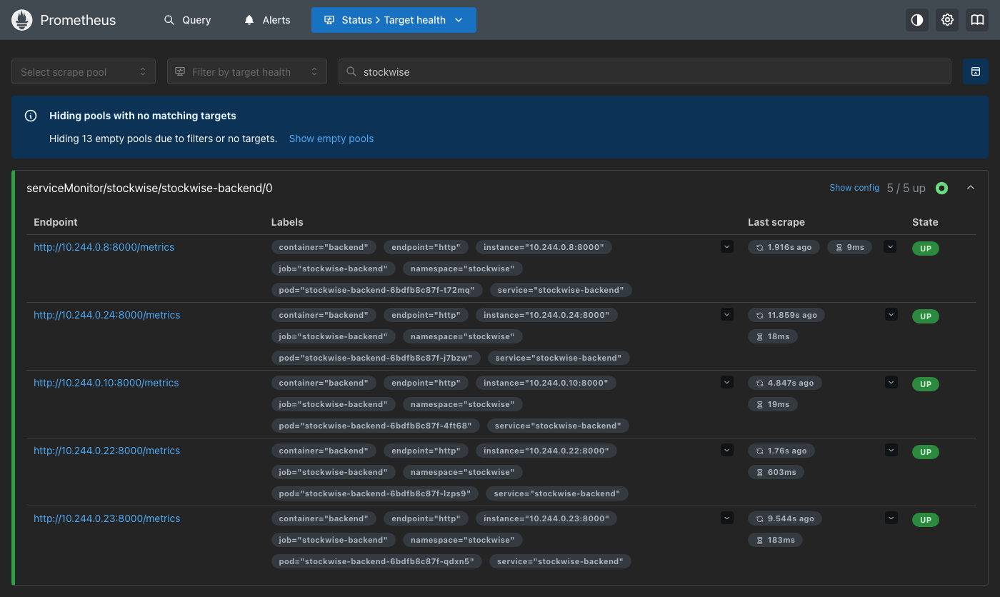
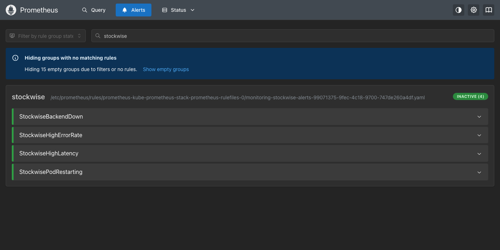

# Monitoring: Prometheus and Grafana

**Name:** Tirth Shah · **Roll Number:** 10316

Monitoring runs inside the cluster with the **kube-prometheus-stack** Helm chart. It installs Prometheus, Grafana, Alertmanager, node-exporter and kube-state-metrics.

| File | Purpose |
|---|---|
| `prometheus-values.yaml` | Prometheus and Alertmanager settings, sized for minikube |
| `grafana-values.yaml` | Grafana settings, including the sidecar that loads dashboards from ConfigMaps |
| `grafana-dashboard.yaml` | The StockWise dashboard (12 panels), as a ConfigMap |
| `alert-rules.yaml` | Four alert rules for the app, as a PrometheusRule |

## How the app is monitored

1. The backend exposes Prometheus metrics at `/metrics` (request count, latency histogram, process CPU and memory) using `prometheus-fastapi-instrumentator`.
2. The Helm chart creates a **ServiceMonitor** that tells Prometheus to scrape every backend pod.
3. kube-state-metrics and cAdvisor add pod CPU, memory, restarts and HPA replica counts.
4. Grafana shows it all on the **StockWise Application** dashboard.

## Install

```bash
helm repo add prometheus-community https://prometheus-community.github.io/helm-charts
helm repo update
kubectl create namespace monitoring
helm upgrade --install kube-prometheus-stack prometheus-community/kube-prometheus-stack \
  --version 92.0.0 -n monitoring \
  -f monitoring/prometheus-values.yaml -f monitoring/grafana-values.yaml --wait

kubectl apply -f monitoring/grafana-dashboard.yaml -f monitoring/alert-rules.yaml

# Turn on the ServiceMonitor in the app chart (needs the CRDs installed above)
helm upgrade stockwise helm/stockwise -n stockwise --reuse-values --set serviceMonitor.enabled=true
```

## Check the metrics endpoint

```bash
kubectl port-forward -n stockwise svc/stockwise-backend 8000:8000
curl -s localhost:8000/metrics | grep http_requests_total
```

## Prometheus

```bash
kubectl port-forward -n monitoring svc/kube-prometheus-stack-prometheus 9090:9090
```

Open http://localhost:9090/targets and search for `stockwise`.



The five targets are the five backend pods that the HPA created during the load test. Every one is `UP`.



| Alert | Fires when |
|---|---|
| `StockwiseBackendDown` | No backend pod can be scraped for 1 minute |
| `StockwiseHighErrorRate` | More than 5% of API requests return 5xx for 2 minutes |
| `StockwiseHighLatency` | 95th percentile latency is above 1 second for 5 minutes |
| `StockwisePodRestarting` | A pod restarts more than twice in 10 minutes |

## Grafana

```bash
kubectl get secret -n monitoring kube-prometheus-stack-grafana -o jsonpath='{.data.admin-password}' | base64 -d; echo
kubectl port-forward -n monitoring svc/kube-prometheus-stack-grafana 3001:80
```

Open http://localhost:3001, sign in as `admin` with the password printed above, and open **Dashboards > StockWise Application**. Run the load test first so the panels have data.

```bash
HOST_HEADER=stockwise.local ./scripts/load-test.sh http://localhost:8088 180
```

| Panel | Shows |
|---|---|
| Backend pods up | How many backend pods Prometheus can scrape |
| API requests / s, by endpoint | Traffic |
| API error rate, responses by status | Errors |
| p95 latency, API latency p50/p95/p99 | Latency |
| CPU and memory by pod | Saturation |
| Backend replicas (HPA) | Autoscaling in action |
| Pod restarts | Stability |

The Grafana screenshot is in the root README under "Screenshots to add".
