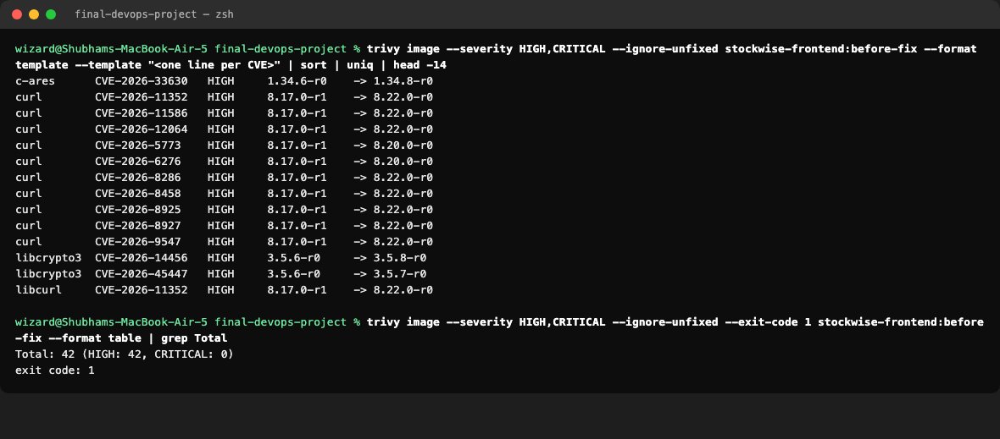

# DevSecOps: Security in the Pipeline

**Name:** Tirth Shah · **Roll Number:** 10316

Every push runs five kinds of security checks. Any failure stops the pipeline before an image is published.

| Check | Tool | What it looks at | Fails the build when |
|---|---|---|---|
| SAST | **Bandit** | Our Python code | A medium or high severity issue is found |
| SAST | **CodeQL** | Python and JavaScript code | Reports to Security > Code scanning |
| SCA | **pip-audit** | Python dependencies in `requirements.txt` | Any known vulnerability |
| SCA | **npm audit** | Node dependencies in `package-lock.json` | A high or critical vulnerability |
| Secret scanning | **Gitleaks** | Every file in the project | A password, key or token is found |
| Image scanning | **Trivy** | Both Docker images, including OS packages | A fixable HIGH or CRITICAL vulnerability |
| Security gate | `needs:` in the workflow | All of the above | Any required check is not green |

## The security gate

```
backend-test ─┐
frontend-build┤
sast ─────────┼──► build-images ──► image-scan ──► security-gate ──► push-images ──► deploy
sca ──────────┤        (built once,                     │
secret-scan ──┘         reused below)                   └── nothing is pushed unless every check passed
```

The images are built **once** and saved as artifacts. Trivy scans that exact image, and the push job uploads that same image. Rebuilding between steps would mean the scanned image is not the shipped one.

## Trivy finding: explained

The first Trivy scan of the frontend image **failed the gate** with 42 HIGH vulnerabilities.



**Example: CVE-2026-14456 in OpenSSL (`libssl3` and `libcrypto3`, version 3.5.6-r0).**

- **What it is:** a denial of service flaw in OpenSSL. A crafted input can make the library use memory without limit, which can crash or stall the process that uses it.
- **Where it came from:** not from our code. It is in an Alpine operating system package inside the `nginx-unprivileged` base image. The base image had been published before the fixed package was released.
- **Why it matters:** nginx and curl in the container link against OpenSSL, so the vulnerable library would ship with every frontend deployment.
- **The fix:** version 3.5.8-r0 fixes it. The frontend Dockerfile now runs `apk upgrade --no-cache` in the runtime stage, then switches back to the non-root nginx user. Other packages in the report, such as curl, c-ares, libexpat and pcre2, were fixed the same way.

After the fix the frontend image is clean, and so is the backend image.


`--ignore-unfixed` hides vulnerabilities that have no fixed version yet, because nothing can be done about them today. The gate only blocks on problems that can be fixed.

## Other hardening

| Measure | Where |
|---|---|
| Both containers run as non-root users (uid 10001 and 101) | Dockerfiles, plus `runAsNonRoot: true` in Kubernetes |
| Linux capabilities dropped, no privilege escalation | Helm chart `securityContext` |
| Database password generated randomly and kept in a Kubernetes Secret | `helm/stockwise/templates/secret.yaml` |
| No credentials in Git: `.env`, `terraform.tfvars` and state files are ignored | `.gitignore` |
| Images tagged with the commit SHA, never `latest` | CI pipeline |
| CI uses the built-in `GITHUB_TOKEN`, so no registry password is stored | `push-images` job |

## Run the image gate locally

```bash
cd final-devops-project
./security/scan-images.sh
```
