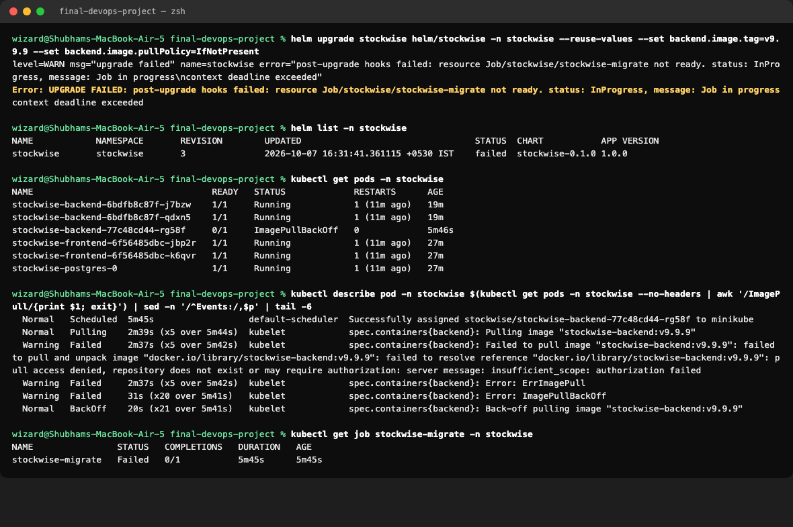
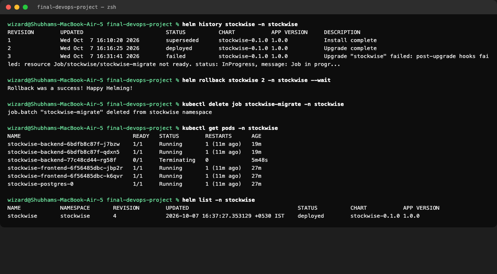
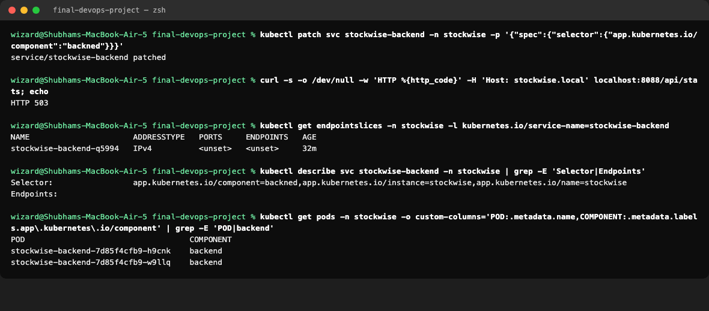
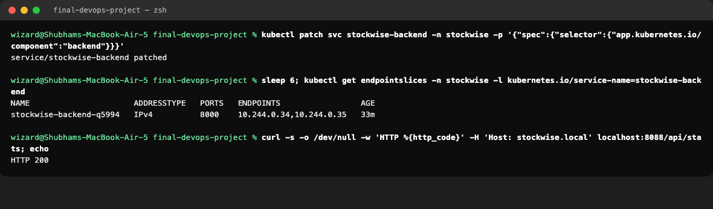
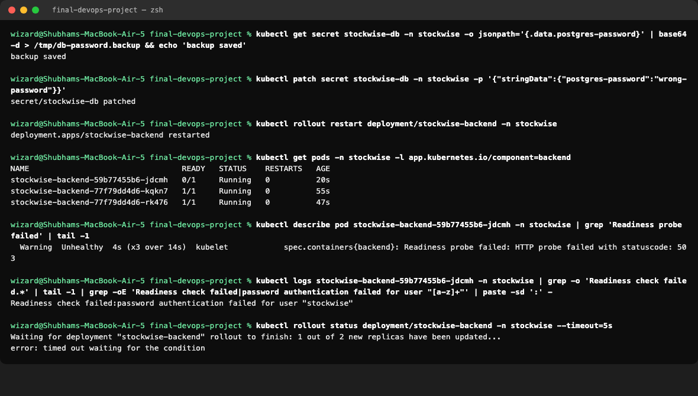
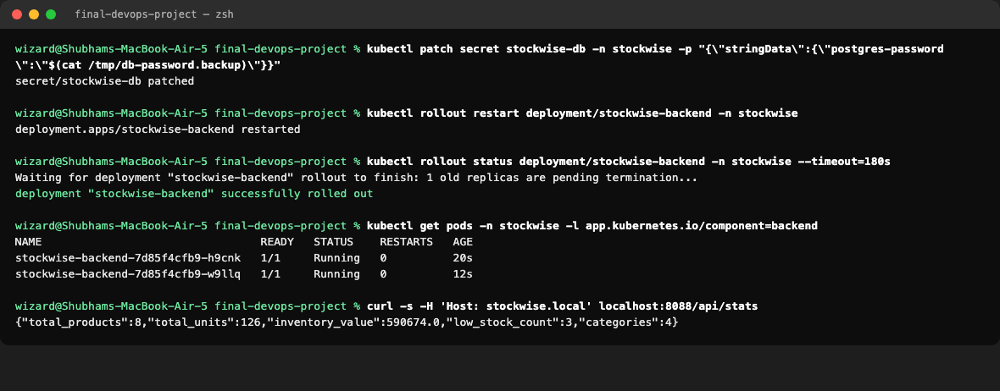
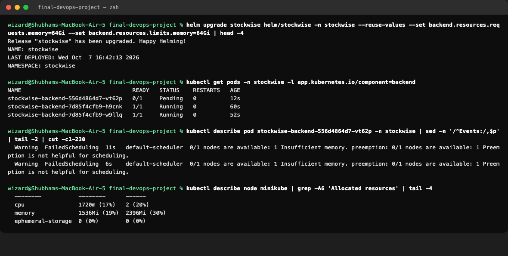
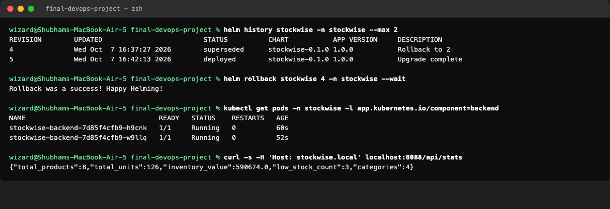

# Final Troubleshooting Challenge

**Name:** Tirth Shah · **Roll Number:** 10316

Four realistic problems were deliberately introduced into the running deployment on minikube. Each was diagnosed with standard commands, fixed and verified. All output below is from the real cluster.

| # | Problem introduced | Symptom | Root cause | Fix |
|---|---|---|---|---|
| 1 | Image tag that does not exist | New pod `ImagePullBackOff`, Helm release `failed` | `backend.image.tag=v9.9.9` | `helm rollback` |
| 2 | Typo in the Service selector | API returns HTTP 503 through the Ingress | Selector `backned` matches no pods, so no endpoints | Correct the selector |
| 3 | Wrong database password in the Secret | New pod `Running` but `0/1` Ready, rollout stuck | Backend cannot log in to PostgreSQL | Restore the Secret, restart |
| 4 | Memory request larger than the node | New pod `Pending` | `FailedScheduling: Insufficient memory` | `helm rollback` |

In every case the **old pods kept serving traffic**. The rolling update never removes a working pod until its replacement is Ready. That is why readiness probes and rolling updates matter.

---

## 1. ImagePullBackOff after a bad release

**Introduce:** a Helm upgrade with an image tag that does not exist.

**Investigate:**
- `kubectl get pods` shows the new pod in `ImagePullBackOff`. The two old pods still run.
- `kubectl describe pod` Events show `Failed to pull image "stockwise-backend:v9.9.9"`.
- The migration Job uses the same image, so it also failed. That made the Helm release `failed` after a 5-minute timeout.

**Root cause:** the tag `v9.9.9` was never built or pushed.

**Fix and verify:** roll back to the last good revision and remove the failed Job.

**Prevention:** CI only deploys tags it has just built and pushed, which are commit SHAs.

---

## 2. Service selector mismatch

**Introduce:** patch the backend Service selector from `backend` to `backned`.

**Investigate:**
- The API returns **HTTP 503** through the Ingress.
- The EndpointSlice for `stockwise-backend` has **no endpoints**.
- `kubectl describe svc` shows `component=backned`, while the pods are labelled `backend`.

**Root cause:** a Service sends traffic only to pods whose labels match its selector. A one-letter typo matched nothing.

**Fix and verify:** correct the selector. The endpoints return and the API answers 200 again.

**Prevention:** never edit live objects by hand. Argo CD's self-heal would have reverted this change automatically.

---

## 3. Wrong database password

**Introduce:** change the password in the `stockwise-db` Secret, then restart the backend.

**Investigate:**
- The new pod is `Running` but `0/1` Ready, and `kubectl rollout status` times out.
- `kubectl describe pod` shows `Readiness probe failed: HTTP probe failed with statuscode: 503`.
- `kubectl logs` shows `password authentication failed for user "stockwise"`.

**Root cause:** PostgreSQL still uses the password it was created with, so the changed Secret no longer matches. The `/ready` endpoint checks the database, so the pod never becomes Ready and never receives traffic.

**Fix and verify:** restore the original password from the backup, then restart the backend. Both pods are Ready and the API works.

**Prevention:** change database passwords inside PostgreSQL and in the Secret together. Keep readiness probes that check dependencies, so a bad config never takes traffic.

---

## 4. Pod stuck in Pending

**Introduce:** a Helm upgrade that requests 64Gi of memory for the backend.

**Investigate:**
- The new pod stays `Pending`.
- Events show `0/1 nodes are available: 1 Insufficient memory`.
- `kubectl describe node` shows the node only has about 8Gi in total.

**Root cause:** the scheduler places a pod only on a node with enough unreserved memory to cover its request. No node had 64Gi.

**Fix and verify:** roll back to the previous revision.

**Prevention:** review resource changes in pull requests, and set namespace ResourceQuotas or LimitRanges.

---

## Commands used

| Command | Used for |
|---|---|
| `kubectl get pods` | Spot the failing pod and its status |
| `kubectl describe pod` | Events: pull errors, probe failures, scheduling errors |
| `kubectl logs` | The application's own error message |
| `kubectl get endpointslices` / `describe svc` | Check whether a Service reaches any pods |
| `kubectl describe node` | Check the capacity left on the node |
| `kubectl rollout status` | See whether a rollout is stuck |
| `helm history` / `helm rollback` | Return to a known good release |
