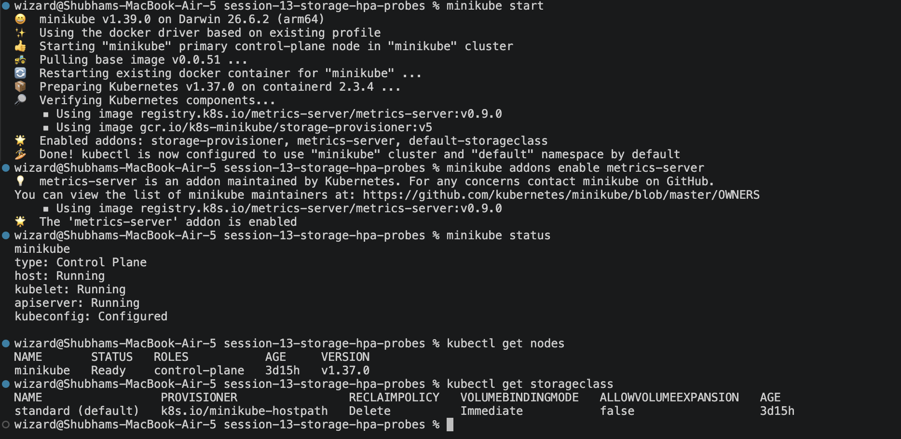

# Session 13: Kubernetes Storage, HPA & Probes

## Folder Structure

```
session-13-storage-hpa-probes/
├── 01-kubernetes-volumes/
│   ├── README.md            # Volume concepts documentation
│   ├── emptydir-pod.yaml
│   ├── hostpath-pod.yaml
│   ├── pv.yaml              # Static PersistentVolume (student-pv)
│   ├── pvc.yaml             # Claim for it (student-pvc)
│   ├── pod.yaml             # Pod using the claim (storage-demo)
│   └── dynamic-pvc.yaml     # Dynamically provisioned claim
├── 02-hpa/
│   ├── deployment.yaml      # hpa-demo (nginx, cpu request 100m)
│   ├── service.yaml         # hpa-demo-service
│   └── hpa.yaml             # 1 to 5 replicas at 50% CPU
├── 03-mini-project/
│   ├── namespace.yaml       # production-webapp
│   ├── pvc.yaml             # web-data, 500Mi
│   ├── deployment.yaml      # web-app, 2 replicas, 3 probes, /data volume
│   ├── service.yaml         # web-service
│   └── hpa.yaml             # web-app-hpa, 2 to 5 replicas at 50% CPU
├── screenshots/
└── README.md
```

Run every command from inside this folder.

---

## Setup

HPA needs CPU metrics, so the metrics-server addon must be on.

```bash
minikube start
minikube addons enable metrics-server
minikube status
kubectl get nodes
kubectl get storageclass
```



---

## Task 1: Kubernetes Volumes

Full notes are in [01-kubernetes-volumes/README.md](01-kubernetes-volumes/README.md).

### 1.1 emptyDir: data is lost when the Pod is deleted

```bash
kubectl apply -f 01-kubernetes-volumes/emptydir-pod.yaml
kubectl wait --for=condition=Ready pod/emptydir-demo --timeout=60s
kubectl exec emptydir-demo -- sh -c 'echo "Hello from emptyDir" > /data/message.txt'
kubectl exec emptydir-demo -- cat /data/message.txt
```


```bash
kubectl delete pod emptydir-demo
kubectl apply -f 01-kubernetes-volumes/emptydir-pod.yaml
kubectl wait --for=condition=Ready pod/emptydir-demo --timeout=60s
kubectl exec emptydir-demo -- cat /data/message.txt
```


**Observation:** The last command fails with "No such file or directory". The emptyDir was deleted together with the Pod.

### 1.2 hostPath: data lands on the node

```bash
kubectl apply -f 01-kubernetes-volumes/hostpath-pod.yaml
kubectl wait --for=condition=Ready pod/hostpath-demo --timeout=60s
kubectl exec hostpath-demo -- sh -c 'echo "Hello from hostPath" > /data/message.txt'
minikube ssh -- cat /tmp/hostpath-data/message.txt
```


**Observation:** The file written inside the Pod is visible directly on the minikube node.

### 1.3 Static PV and PVC

```bash
kubectl apply -f 01-kubernetes-volumes/pv.yaml
kubectl get pv
kubectl apply -f 01-kubernetes-volumes/pvc.yaml
kubectl get pvc
kubectl apply -f 01-kubernetes-volumes/pod.yaml
kubectl get pods
```


**Observation:** `student-pv` starts as `Available`. After the claim is created both show `Bound`.

### 1.4 Data survives Pod deletion

```bash
kubectl wait --for=condition=Ready pod/storage-demo --timeout=60s
kubectl exec storage-demo -- sh -c 'echo "Hello from PersistentVolume" > /data/message.txt'
kubectl delete pod storage-demo
kubectl apply -f 01-kubernetes-volumes/pod.yaml
kubectl wait --for=condition=Ready pod/storage-demo --timeout=60s
kubectl exec storage-demo -- cat /data/message.txt
```


**Observation:** Unlike emptyDir, the file is still there because it lives on the PersistentVolume, not inside the Pod.

### 1.5 StorageClass and dynamic provisioning

```bash
kubectl describe storageclass standard
kubectl apply -f 01-kubernetes-volumes/dynamic-pvc.yaml
kubectl get pvc dynamic-pvc
kubectl get pv
```


**Observation:** No PV was written by hand. A new PV named `pvc-<id>` was created automatically by the `standard` StorageClass.

### Cleanup Task 1

```bash
kubectl delete -f 01-kubernetes-volumes/
```

---

## Task 2: HPA Hands-on

### 2.1 Deploy the application

```bash
kubectl apply -f 02-hpa/deployment.yaml
kubectl apply -f 02-hpa/service.yaml
kubectl get deployment
kubectl get pods
kubectl get svc
```


### 2.2 Configure and verify the HPA

```bash
kubectl get pods -n kube-system | grep metrics-server
kubectl top nodes
kubectl top pods
kubectl apply -f 02-hpa/hpa.yaml
kubectl get hpa
kubectl describe hpa hpa-demo
```

If `TARGETS` shows `<unknown>/50%`, wait one minute and run `kubectl get hpa` again.


### 2.3 Deploy the load generator and watch scaling

```bash
kubectl run load-generator \
  --image=busybox:1.36 \
  --restart=Never \
  -- /bin/sh -c \
  "while true; do wget -q -O- http://hpa-demo-service; done"
```

Open a second terminal and watch the HPA for 2 to 3 minutes.

```bash
kubectl get hpa -w
```

nginx is very light. If CPU stays below 50% after two minutes, add more load generators in a third terminal.

```bash
for i in 2 3 4; do
  kubectl run load-generator-$i --image=busybox:1.36 --restart=Never \
    -- /bin/sh -c "while true; do wget -q -O- http://hpa-demo-service; done"
done
```


Press `Ctrl+C`, then capture the result.

```bash
kubectl get pods
kubectl top pods
kubectl describe hpa hpa-demo
```


**Observation:** CPU went above the 50% target, so the HPA increased the replicas. The `Events` section of `describe hpa` lists each `SuccessfulRescale`.

### 2.4 Stop the load and watch scale-down

```bash
kubectl delete pod load-generator load-generator-2 load-generator-3 load-generator-4 --ignore-not-found
kubectl get hpa -w
```

The default scale-down stabilization window is 5 minutes. After that the replicas drop back to 1. Press `Ctrl+C`, then run:

```bash
kubectl get hpa
kubectl get pods
```


### How HPA calculates CPU

- CPU request is `100m`.
- CPU usage of `50m` means utilization is `50%`.
- `desiredReplicas = ceil(currentReplicas × currentCPU% / targetCPU%)`, so 2 Pods at 150% with a 50% target gives 6, capped at `maxReplicas: 5`.

### Cleanup Task 2

```bash
kubectl delete -f 02-hpa/
```

---

## Task 3: Mini Project — Production-Ready Kubernetes Web App

The app combines three pillars:

1. **State persistence:** a PVC keeps data in `/data` across Pod deletions.
2. **Elastic scaling:** an HPA scales between 2 and 5 replicas at 50% CPU.
3. **Health checks:** startup, readiness and liveness probes.

### Architecture

```text
                           [ Service: web-service ]
                                      │ (Port 80)
                ┌─────────────────────┼─────────────────────┐
                ▼                     ▼                     ▼
          [ Pod: web-app-1 ]    [ Pod: web-app-2 ]    [ Pod: web-app-N ]
          ├─ Startup Probe      ├─ Startup Probe      ├─ Startup Probe
          ├─ Readiness Probe    ├─ Readiness Probe    ├─ Readiness Probe
          ├─ Liveness Probe     ├─ Liveness Probe     ├─ Liveness Probe
          └─ CPU Requests       └─ CPU Requests       └─ CPU Requests
                                      │
                                      ▼
                        [ HPA: web-app-hpa (50% CPU) ]
                                      ▲
                                      │ pulls metrics
                              [ Metrics Server ]

Pod ── VolumeMount: /data ── PVC: web-data (500Mi, RWO) ── StorageClass: standard
```

### 3.1 Create the namespace and PVC

```bash
kubectl apply -f 03-mini-project/namespace.yaml
kubectl apply -f 03-mini-project/pvc.yaml
kubectl get pvc -n production-webapp
```


### 3.2 Deploy the application and Service

```bash
kubectl apply -f 03-mini-project/deployment.yaml
kubectl apply -f 03-mini-project/service.yaml
kubectl get pods -n production-webapp
kubectl get svc -n production-webapp
```


### 3.3 Deploy the HPA

```bash
kubectl apply -f 03-mini-project/hpa.yaml
kubectl get hpa -n production-webapp
```


### 3.4 Verification Task 1: Storage persistence

Replace `Your Name` with your name.

```bash
POD_NAME=$(kubectl get pods -n production-webapp -l app=web-app -o jsonpath='{.items[0].metadata.name}')
kubectl exec -n production-webapp "$POD_NAME" -- sh -c 'echo "Student: Your Name" > /data/student.txt'
kubectl exec -n production-webapp "$POD_NAME" -- cat /data/student.txt
kubectl delete pod -n production-webapp "$POD_NAME"
```


Wait until the replacement Pod is `Running`, then read the file again.

```bash
kubectl get pods -n production-webapp
NEW_POD=$(kubectl get pods -n production-webapp -l app=web-app -o jsonpath='{.items[0].metadata.name}')
kubectl exec -n production-webapp "$NEW_POD" -- cat /data/student.txt
```


**Observation:** The Pod was terminated and replaced, but the data stayed on the PersistentVolume.

### 3.5 Verification Task 2: Service

```bash
kubectl port-forward -n production-webapp svc/web-service 8080:80
```

In a second terminal:

```bash
curl http://localhost:8080
```


Stop the port-forward with `Ctrl+C`.

### 3.6 Verification Task 3: Trigger HPA scaling

```bash
kubectl run load-generator -n production-webapp \
  --image=busybox:1.36 \
  --restart=Never \
  -- /bin/sh -c "while true; do wget -q -O- http://web-service; done"
```

In a second terminal:

```bash
kubectl get hpa -n production-webapp -w
```

If CPU stays below 50% after two minutes, add more load in a third terminal.

```bash
for i in 2 3 4; do
  kubectl run load-generator-$i -n production-webapp --image=busybox:1.36 --restart=Never \
    -- /bin/sh -c "while true; do wget -q -O- http://web-service; done"
done
```


Stop the load and watch it scale down. This takes about 5 minutes.

```bash
kubectl delete pod -n production-webapp load-generator load-generator-2 load-generator-3 load-generator-4 --ignore-not-found
kubectl get hpa -n production-webapp -w
```


### 3.7 Bonus: Readiness gating

Point the readiness probe at a path that does not exist.

```bash
kubectl patch deployment web-app -n production-webapp --type=json \
  -p='[{"op":"replace","path":"/spec/template/spec/containers/0/readinessProbe/httpGet/path","value":"/does-not-exist"}]'
```

Wait about 30 seconds.

```bash
kubectl get pods -n production-webapp
kubectl get endpoints -n production-webapp web-service
```


**Observation:** The Pods are `Running` but `READY` is `0/1`, and the Service has no endpoints. Readiness failure removes Pods from traffic without restarting them.

### 3.8 Bonus: Liveness restart loop

Restore the deployment, then point the liveness probe at a path that does not exist.

```bash
kubectl apply -f 03-mini-project/deployment.yaml
kubectl patch deployment web-app -n production-webapp --type=json \
  -p='[{"op":"replace","path":"/spec/template/spec/containers/0/livenessProbe/httpGet/path","value":"/crash"}]'
kubectl get pods -n production-webapp -w
```

Watch for about a minute, press `Ctrl+C`, then:

```bash
kubectl describe pod -n production-webapp -l app=web-app | grep -A2 -E "Liveness|Unhealthy"
```


**Observation:** nginx returns 404 for `/crash`. After 3 failed checks 5 seconds apart, the kubelet restarts the container, so `RESTARTS` goes up about every 15 seconds.

Restore the working deployment.

```bash
kubectl apply -f 03-mini-project/deployment.yaml
kubectl get pods -n production-webapp
```

### Probe reference

| Probe | Question it answers | Action on failure |
|---|---|---|
| Startup | Has the process initialized? | Restarts the container. Other probes wait until it passes. |
| Readiness | Can the Pod receive traffic? | Removes the Pod IP from Service endpoints. Does not restart. |
| Liveness | Is the container alive and responsive? | Kubelet restarts the container. |

### Troubleshooting notes

| Issue | Check | Root cause | Fix |
|---|---|---|---|
| PVC stuck in `Pending` | `kubectl describe pvc web-data -n production-webapp` | No default StorageClass | `minikube addons enable default-storageclass` |
| HPA shows `<unknown>/50%` | `kubectl top pods -n production-webapp` | metrics-server off or no CPU request | Enable metrics-server and keep `cpu: 100m` request |
| CrashLoopBackOff | `kubectl describe pod <pod> -n production-webapp` | Wrong probe path or port | Probe path must return HTTP 200 to 399 |

### Cleanup Task 3

```bash
kubectl delete namespace production-webapp
```

---

## Key Learnings

- **emptyDir** shares files inside one Pod and disappears with it.
- **hostPath** keeps data on one node and should be avoided for real apps.
- **PV and PVC** separate storage from the Pod, so data outlives Pods.
- **StorageClass** with dynamic provisioning creates PVs on demand.
- **HPA** needs CPU requests and metrics-server, and scales on average CPU against the request.
- **Readiness** failure removes a Pod from traffic. **Liveness** failure restarts it. **Startup** protects slow-starting apps.
